# GPM 模型解决

**G**: gorotine    协程
**P**: processor   处理器
**M**: thread      内核线程

**全局队列**: 存放等待运行的G

**P的本地队列**:  
    
    1 存放等待运行的G
    2 数据限制 不超过256个G
    3 优先将新创建的G放在P的本地队列中，如果满了会放到全局队列中
                
**P列表**：

    1. 程序启动时创建
    2. 最多有GOMAXPROCS个（可配置） 

**P和M的数量** 
    
1.P的数量问题：
 
 * 环境变量 $GOMAXPROCS
 * 在程序中通过 runtime.GOMAXPROCS() 来设置
 
**注意**: GOMAXPROCS 数量是同一个时刻执行，而不是宏观的并发

2.M的数量问题：

* GO语言本身是限定M的最大量是10000(忽略)
* runtime/debug 包中的SetMaxThreads 函数来设置的
* 有一个M阻塞，会创建一个新的M
* 如果有M空闲，那么就会回收或睡眠


## 调度的设计策略：

**复用线程**

1. 避免频繁的创建、销毁线程，而且对线程的复用

* **work stealing 机制:** 当本线程无可运行的G时，尝试从其他线程绑定的P偷取G，而不是销毁线程


* **hand off 机制:** 当本线程因为G进行系统调用阻塞是，线程释放绑定的P，把P转移给其他空闲的线程执行。

**利用并行**: GOMAXPROCS 设置P的数量，最多有GOMAXPROCS个线程分布在多个CPU上同时执行

**抢占:** 在 goroutine 中等待一个协程主动让出CPU才执行下一个协程，在Go中，一个 goroutine 最多占用CPU 10ms,防止其他goroutine被饿死

**全局G队列：** 当M执行work setealing 从其他P偷不到G时，可以从全局队列获取G


## "go func()" 经历了流程

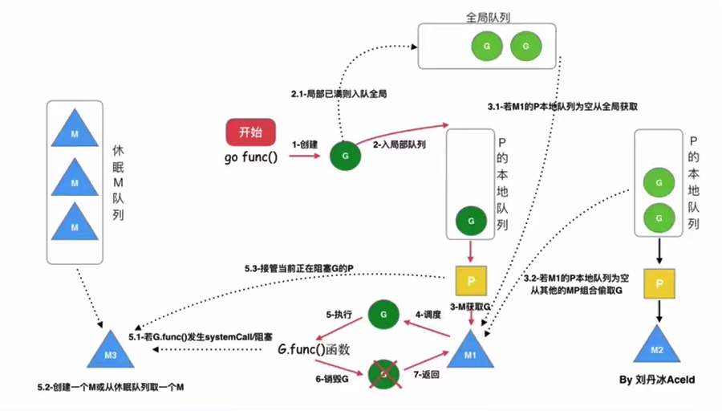

1. 我们通过go func() 来创建一个goroutine；
2. 有两个存储G的队列，一个是局部调度器P的本地队列，一个是全局G队列。新创建的G会先保存在P的队列中，如果P的本地队列已经满了就会保存在全局的队列中；
3. G只能执行在M中，一个M必须持有一个P，M与P是1：1的关系。M会从P的本地队列弹出一个可执行状态的G来执行,如果P的本地队列为空，就会重其他的MP组合头取一个可执行的G来执行；
4. 一个M调度G执行的过程是一个循环机制；
5. 当M执行某一个G时候如果发生了syscal 或其余阻塞操作，M会阻塞，如果当前有一些G在执行，runtime会把这个线程M从P中摘除(detach),然后在创建一个新的操作系统的线程（如果有空闲的线程可用就复用空闲线程）来服务与这个P；
6. 当M系统调用结束时候，这个G会尝试获取一个空闲的P执行，并放入到这个P的本地队列，如果获取不到P，这个线程M变为休眠状态，加入到空闲线程中，然后这个G会被放入全局队列中

## 调度器的生命周期：

**M0**：M0是启动程序后编号为0的主线程，这个M对应的实例会在全局变量runtime.m0中，不需要在heap上分配，M0负责执行初始化操作和启动第一个G，在之后M0就和其他的M一样的。

**G0**：G0是每次启动一个M都会第一个创建的gourtime,G0仅用于负责调度的G，G0不指向任何可执行的函数，每个M都会有一个自己的G0，在调度或系统调用时会使用G0的栈空间，全局变量的G0是M0的G0

## 可视化的GMP编程
* 基本的trace 编程
1. 创建trace文件：
```go
f,err := os.Create("trace.out)
```
2. 启动 trace
```go
trace.Start(f)
```
3. 停止 trace
```go
trace.Stop()
```
4. go build 并且运行之后，会得到一个trace.out 文件


* 通过go tool trace 工具打开trace文件 
```sh
go tool trace trace.out
```
访问：http://127.0.0.1:51672

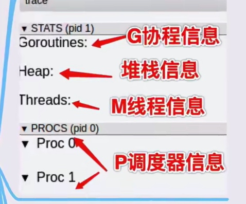


1. G的信息
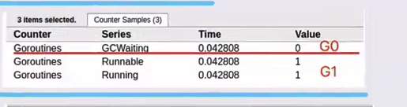

2. M的信息
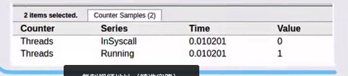

3. P的信息
 


* 通过 Debug trace 查看GMP信息

1. 通过 GODEBUG=schedtrace=1000 ./trace2 
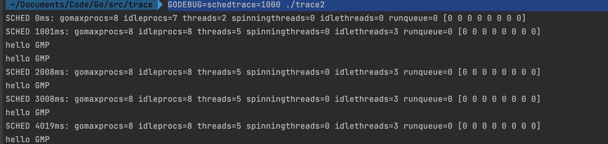

 SCHED: 调式的信息
 
 0ms:  从程序启动到输出经历的时间
 
 gomaxprocs: P的数量 一般默认是和CPU的核心数是一致的
 
idleprocs: 处理idle状态的P的数量，gomaxprocs-idleprocs=目前正在执行的p的数量

threads: 线程数量(包括M0，包括GODEBUG调试的线程)

spinningthreads: 处于自旋状态的thread数量

idlethreads: 处理idle(空闲)状态的 thread

runqueue: 全局G队列中的G的数量

[0 0 0 0 0 0 0 0]: 每一个P的local queue 本地队列中，目前存在G的数量
 
 
 ## 场景示例
 
 1. **G1 创建 G2**
 
    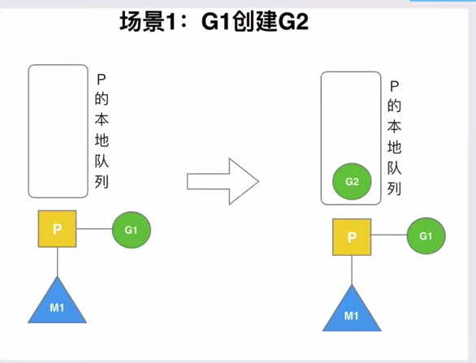

P拥有G1，M1 获取P后开始运行G1，G1使用go func（）创建了G2，为了局部性G2优先加入到P1的本地队列中

 2. **G2执行完毕**
  
    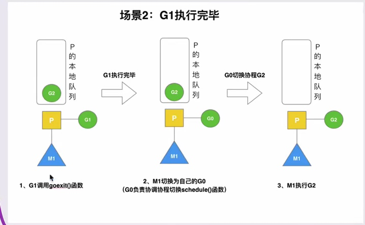

G1 运行完成后（函数：goexit）,M1运行的goroutine切换为G0，G0负责调度时协程的切换（函数：schedule）。从P的本地队列取G2，从G0切换到G2(函数：execute)。实现了线程M1的复用。

 3. **G2开辟过多的G**
 
 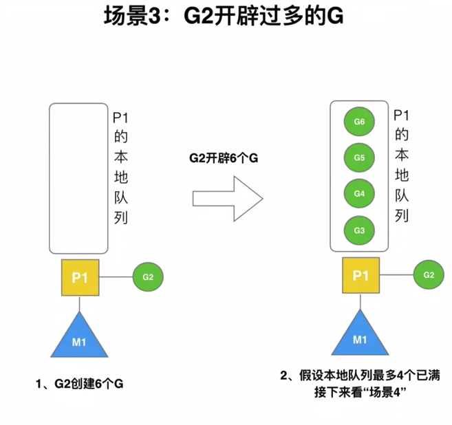

 
 4. G2本地满再创建 G7
 
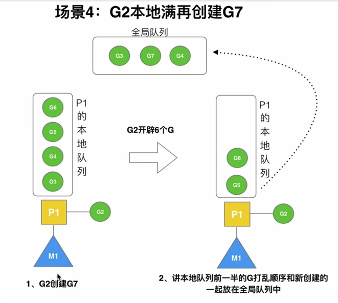

5. G2本地未满创建G8


6. 唤醒正在休眠的M
 
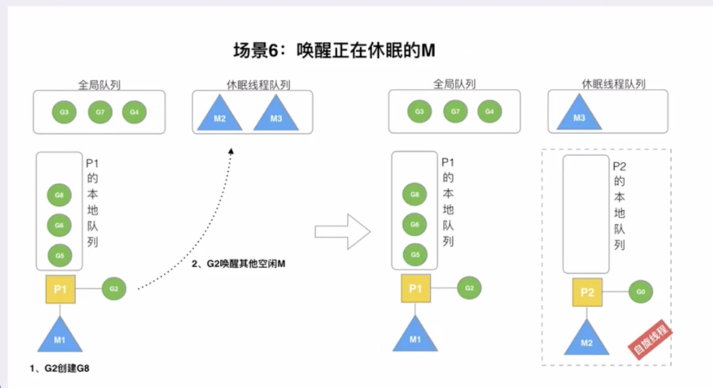

规定：在创建G时，运行的G会尝试唤醒其他空闲的P和M组合去执行

假定：G2唤醒了M2，M2绑定了P2，并运行G0，但P2本地队列没有G，M2此时为自旋线程（没有G但为了运行状态的线程，不断寻找G）。


7. 被唤醒的M2从全局队列批量获取G

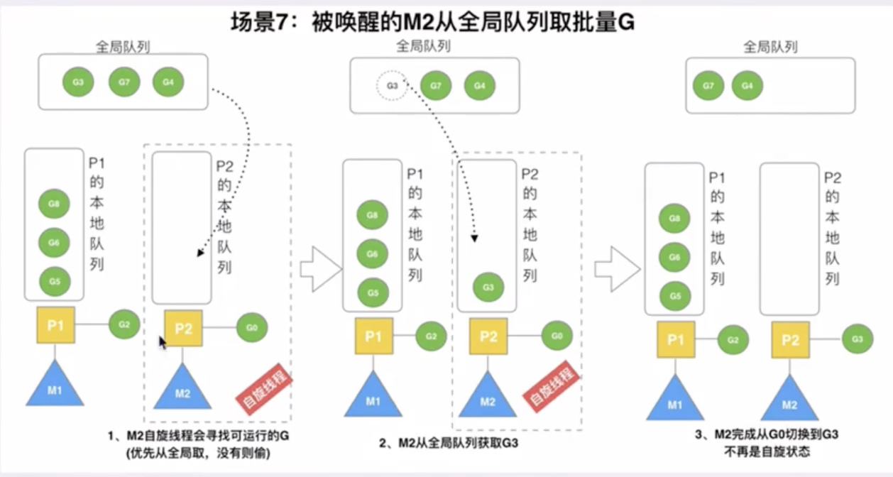


M2尝试从全局队列（简称：“GQ”）取一批G放到P2的本地队列（函数：findrunnable()）。M2从全局队列取的G数量公式：
```go
n = min(len(GQ)/GOMAXPROCS+1,len(GQ/2))
```

8. M2从M1中偷取G

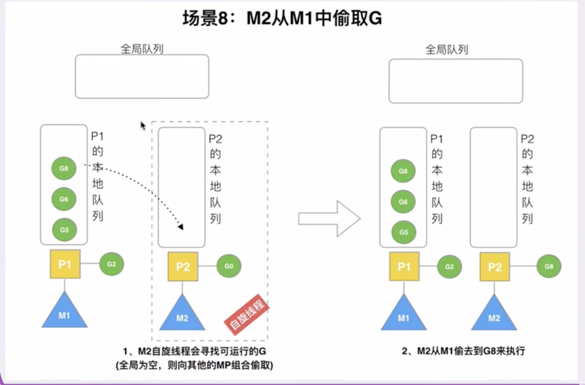

全局队列已经没有G，那M就要执行work stealing（偷取），从其他有G的P哪里偷取一半G过来，放到直接的P本地队列。P2从P1的本地队列尾部取一半的G，本例中一半则只有1个G8，放到P2的本地队列并执行。

9. 自旋线程的最大限制

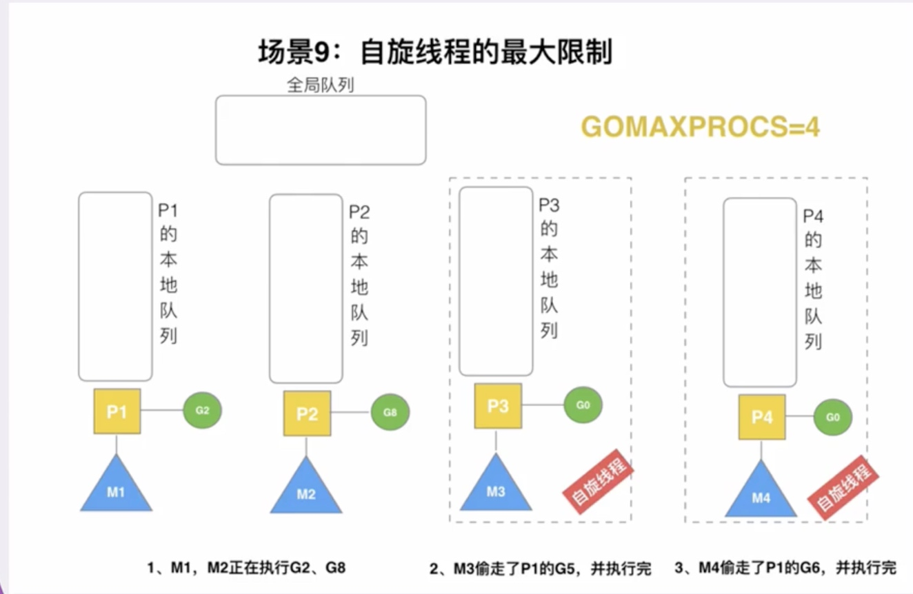

最多有GOMAXPROCS个自旋的线程（当前例子中的GOMAXPROCS=4,所以一个有4个P），多余的没事做线程会让他们休眠。

10. G发生系统调用/阻塞
 
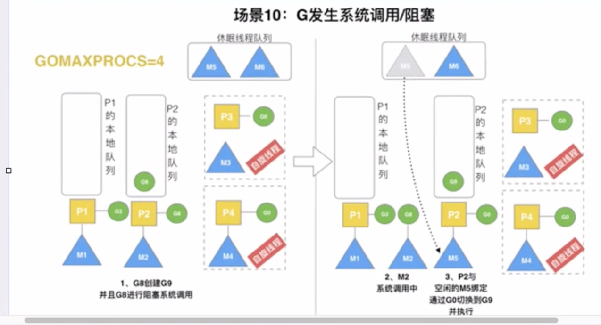


假定当前除了M3与M4为自旋线程，还有M5和M6为空闲的线程（没有得到P的绑定，注意我们这个最多就是能够存在4个P，所以P的数量应该永远是M>P,大部分都是M在抢占需要运行的P），G8创建G9，G8进行堵塞的系统调用，M2和P2立即解除绑定，P2会执行一下判断：如果P2本地队列有G，全局队列有G或空闲的M，P2都会立马唤醒1个M和它绑定，否则P2则会加到空闲P列表，等待M来获取可用的P.本场景中，P2本地队列有G9，可以和其他空闲的线程M5绑定。


11. G发生系统调用/非阻塞

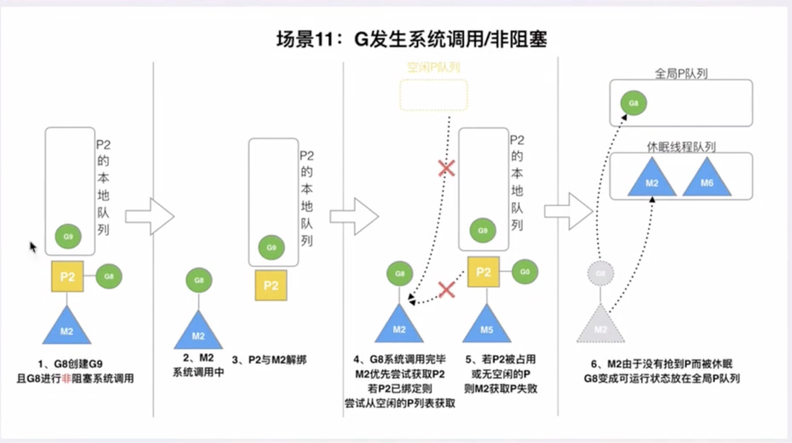

M2和P2会解绑，但是M2会记住P2，然后G8和M2进入系统调用状态，当G2和M2退出系统调用时，会尝试获取P2，如果无法获取，则获取空闲的P，如果依然没有，G8会被标记为可运行的状态，并加入全局队列，M2因为没有P的绑定而变成休眠状态(长时间休眠等待GC回收销毁)


参考：https://www.kancloud.cn/aceld/golang/1958304