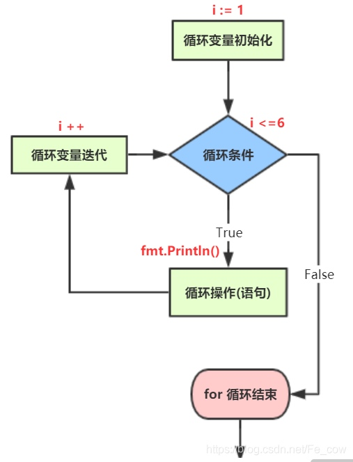

# for 函数
## for 循环控制
### 基本概念
**基本语法**
    
    for 循环变量初始化; 循环条件; 循环变量迭代{
        循环操作(语句)
    }

简单使用：

```go
	for i := 0; i < 5; i++ {
		fmt.Println("输出结果:",i)
	}

// 输出结果: 0
// 输出结果: 1
// 输出结果: 2
// 输出结果: 3
// 输出结果: 4
```    

for 循环 执行流程图：



**使用细节、注意事项**

1. 循环条件是返回一个布尔值的表达式
2. for 循环的第二种基本方式：
* 基本语法

```go    
      for 循环判断条件 {
         // 循环执行语句
      }
      将变量初始化和变量迭代写到其它位置
```
*  例子
```go
package main
import("fmt")

func main(){
    // for 循环的第二种写法
    i := 1 // 循环变量的初始化
    for i <= 6 {  // 循环条件
        fmt.Println("输出结果: ", i)
        i++ // 循环遍历迭代
    }
}
// 输出结果：
输出结果： 1
输出结果： 2
输出结果： 3
输出结果： 4
输出结果： 5
输出结果： 6
```

3. for 循环第三种使用方式：

* 基本用法
 ```go       
    for {
     // 循环执行语句
    }
```

* 上面写法等价 for ; ;{}，是一个无限循环，通常需要 break语句使用
* 例子
```go
package main
import("fmt")

func main(){
    // for 循环的第三种写法，这种写法通常会需要 break 配合使用
    i := 1
    for {  // 等价于 for ;;{}
        if  i <= 6 {
            fmt.Println("ok",i)
        }else{
            break // break 跳出循环
        }
        i++
    }
}
// 输出结果：
ok 1
ok 2
ok 3
ok 4
ok 5
ok 6
```

**for-range 的使用**

* 基本语法
```go
for index,value := range 常量 {
// 循环操作语句
}
```
* 例子

```go
package main

func main(){
    // for - range 的简单使用
    i := "abcdefg"
    for index,value := range i {
        fmt.Printf("index=%d val=%c \n",index,val)
    }
}

// 输出结果：
index=0  val=a
index=1  val=b
index=2  val=c
index=3  val=d
index=4  val=e
index=5  val=f
index=6  val=g
```

index: 是变量 i 值对应的索引（下标）

val: 是字符串中对应的值；

### for 与 for-range 区别
如果字符串中含有中文，使用for循环遍历字符串方式，提示错误，出现乱码。for 循环对字符串的遍历是字节遍历，而不是一个汉字在 utf-8 编码对应的是3个字节


 **for循环传统的方式**

 需要将 str 转换 []rune 切片：

```go
package main
import(
    "fmt"
)
func main(){
    // for 循环传统方式 。变量中文字符串
    var str string = "hello world 中国"
    str1 := []rune(str)
    for i=0;i < len(str1);i++{
        fmt.Printf("%c \n",str1[i])
    }   
}
// 输出结果
h
e
l
l
o
,
w
o
r
l
d
中
国
```

**for-range 循环方式:**
* for-range 遍历方式，按照字符方式遍历：

```go
package main
import(
 "fmt"
)

func main(){
    var str string = "hello,world 中国"
    for index,val := range str{
        fmt.Printf("index=%d, val=%c\n", index, val)
    }
}
// 输出结果：
index=0  val=a
index=1  val=b
index=2  val=c
index=3  val=d
index=4  val=e
index=5  val=f
index=6  val=g
index=0, val=h
index=1, val=e
index=2, val=l
index=3, val=l
index=4, val=o
index=5, val=,
index=6, val=w
index=7, val=o
index=8, val=r
index=9, val=l
index=10, val=d
index=11, val= 
index=12, val=中
index=15, val=国

```
总结：

1. 传统的for循环遍历包含中文字符串，需要将字符串转换 **[]rune(字符串)切片**。默认是字节方式进行处理；
    
2. 对于for-range循环遍历包含中文字符串，直接遍历既可。默认是按照字符串处理，无需转换；

## break 的使用

### 基本概念：
break 语句用于终止某个语句块的执行，用于中断当前for循环或跳出switch语句

**基础语法**

```go
{ undefind
    ...
    break
    ...
}
``` 

**基础使用**

```go
func main(){
    for i:=0;i<4;i++{
        for j:=0;j<10;j++{
            if j == 2{
              break
            }
            fmt.Println("j=",j)
        }
    }
}
```
* break 默认跳出最近 for 循环

### 注意事项

break 语句在多层嵌套语句块中时，可以通过标签指明终止那一块语句块；
```go
func main(){
    lable1:
    for i:=0;i<4;i++{
        for j:=0;j<10;j++{
            if j ==2{
                break lable1
            }
            fmt.Println("j=",j)
        }
    }
}
```

break 后面可指定标签，跳出标签对应循环

## continue

**基本概念：**

continue 语句用于结束本次循环，继续执行下一次循环。

continue 语句出现在多层嵌套的循环语句体中，可以通过标签指明要跳过的是哪一层循环。与break 标签的使用规则一样。

基础语法：

```go
{
...
continue
...
}
```

**基本使用：**

```go
package main

import (
	"fmt"
)

func main(){
	
	for i:= 0; i < 2; i++ {
		for j := 0; j < 6 ; j ++{
			if j == 2 {
				continue
			}
			fmt.Println("j=", j)
		}
	}
	
}
// 输出结果：
j= 0
j= 1
j= 3
j= 4
j= 5
j= 0
j= 1
j= 3
j= 4
j= 5

```