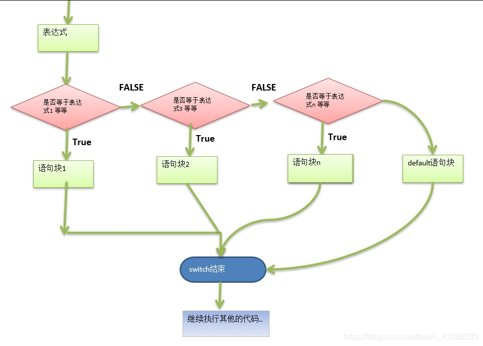

# switch 函数
## 基本的介绍

* switch 语句用于基于不同条件执行不同动作，每一个case 分支都是唯一的，从上到下逐个测试，直到匹配为止
* 匹配项后面不需要在加 break

## 基本语法

```go
switch 表达式 {
case 表达式1，表达式2，...:
    语句块1
case 表达式3，表达式4，...:
    语句块2
// 这里可以多个case 语句
default:
    语句块   
}
```

### switch 的流程图



对上图的说明和总结
* switch 的执行的流程是，先执行表达式，得到值，然后和 case 的表达式进行比较，如果相等，就匹配到，然后执行对应的 case 的语句块，然后退出 switch 控制。
* 如果 switch 的表达式的值没有和任何的 case 的表达式匹配成功，则执行 default 的语句块。执行后退出 switch 的控制.
* golang 的 case 后的表达式可以有多个，使用 逗号 间隔
* golang 中的 case 语句块不需要写 break , 因为默认会有,即在默认情况下，当程序执行完 case 语句块后，就直接退出该 switch 控制结构。

**演示案例**
比如: a,b,c,d,e,f,g a表示星期一，b表示星期二 … 根据用户的输入显示相依的信息.要求使用 switch 语句完成

```go
//分析思路
// 1. 定义一个变量接收字符
// 2. 使用switch 完成

var key byte
fmt.Println("请输入一个字符 a,b,c,d,e,f,g")
fmt.Scanf("%c",&key)
switch key { // 将语法现象
    case 'a':
        fmt.Println("周一")
    case 'b':
        fmt.Println("周二")
    case 'c':
        fmt.Println("周三")
    // ...
    
 	default:
 		fmt.Println("输入有误...")
}
//输出结果：
请输入一个字符 a,b,c,d,e,f,g
b
周二
```
## switch 的使用的注意事项和细节

* case/switch 后是一个表达式(即：常量值，变量、一个有返回值的函数等都可以)

```go
func test(char byte) byte{
    retrun char + 1
}

func main(){
    var key byte

fmt.Println("请输入一个字符 a,b,c,d,e,f,g")
fmt.Scanf("%c", &key)
 
switch test(key)+1 { //将语法现象
	case 'a':
		fmt.Println("周一, 猴子穿新衣")
	case 'b':
		fmt.Println("周二，猴子当小二")
	case 'c':
		fmt.Println("周三，猴子爬雪山")
	//...
	default:
		fmt.Println("输入有误...")
    }
}
```
* case 后的各个表达式的值的数据类型，必须和switch的表达式的数据类型一致
```go
var n1 int32 = 20
var n2 int64 = 20
switch n1{
case n2: // 错误，原因是 n2 的数据类型与n1的类型不一致
    fmt.Println("ok1")
default:
    fmt.Println("没有匹配到")
}
```
* case 后面可以带多个表达式，使用逗号间隔

```go
var n1 int32 = 51
var n2 int64 = 20
switch n1{
case n1,10,5: // case 后面可以多个表达式
    fmt.Println("ok1")
case 90:
    fmt.Println("ok2~")    
}
```

* case 后面的表达式如果是常量值（字面量），则要求不能重复
```go
var n1 int32 = 51
var n2 int64 = 20
switch n1{
case n1,10,5: // case 后面可以多个表达式
    fmt.Println("ok1")
case 5:  // 错误，因为前面的case 已经常量5 因此重复，就会报错误 
    fmt.Println("ok2~") 
default:
    fmt.Println("没有匹配到")   
}
```

* case 后面不需要带break ，程序匹配到一个case后就会执行对应的代码块，运行完后，直接退出switch，如果没有匹配到，则执行default
*  default 语句不是必须的
*  switch 后面可以不带表达式，类型 if--else分支来使用

```go
// switch 后也可以不带表达式， 类似 if--else 分支
var age int = 10
switch {
    case age == 10:
        fmt.Println("age == 10")
    case age == 20:
        fmt.Println("age == 20")
    default:
    fmt.Println("没有匹配到")        
}
```

```go
// case 中也可以对应访问
var score int = 10
switch{
case score > 90 :
		fmt.Println("成绩优秀..")
	case score >=70 && score <= 90 :
		fmt.Println("成绩优良...")
	case score >= 60 && score < 70 :
		fmt.Println("成绩及格...")
	default :
		fmt.Println("不及格")
}
```
* switch 后也可以直接声明/定义一个变量，分号结束，不推荐
```go
switch grade := 90; { // 在golang中，可以这样写
	case grade > 90 :
		fmt.Println("成绩优秀~..")
	case grade >=70 && grade <= 90 :
		fmt.Println("成绩优良~...")
	case grade >= 60 && grade < 70 :
		fmt.Println("成绩及格~...")
	default :
		fmt.Println("不及格~")
}
```
* switch 穿透-fallthrough, 如果在case 语句块后添加 fallthrough,则表示会继续执行下一个case，也叫 switch 穿透
```go
var num int = 10
switch num {
    case 10:
        fmt.Println("ok1")
        fallthrough
    case 20:
        fmt.Printlm("ok2")
    case 30:
        fmt.Println("ok3")
    default:
        fmt.Println("没有匹配到..")        
}
// 输出结果：
ok1
ok2
ok3
```
* Type Switch: swith 语句还可以被用于 type-switch 来判断某个 interface 变量中实际指向的变量类型
```go
var x interface{}
var y = 10.0
x = y
switch i := x.(type){
 case nil:
    fmt.Printf(" x 的类型 ~: %T",i)
 case int:
    fmt.Printf(" 是int型")
 case float64:
    fmt.Printf(" 是float64")
 case func(int ) float64:
    fmt.Printf("x 是 func(int) 型")   
 case bool,string:
 fmt.Prinf("x 是 bool or string 类型")
 default:
    fmt.Printf("未知")
} 
```