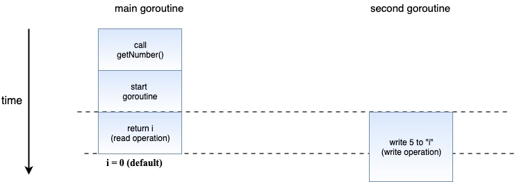
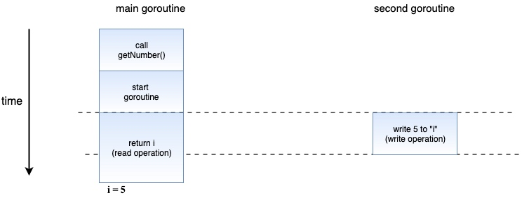
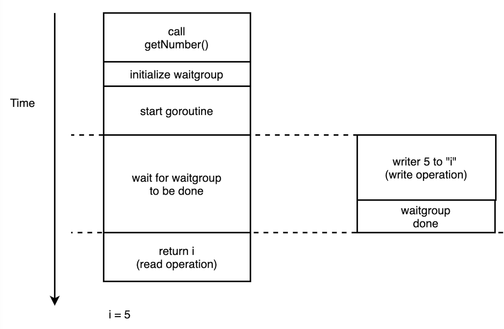
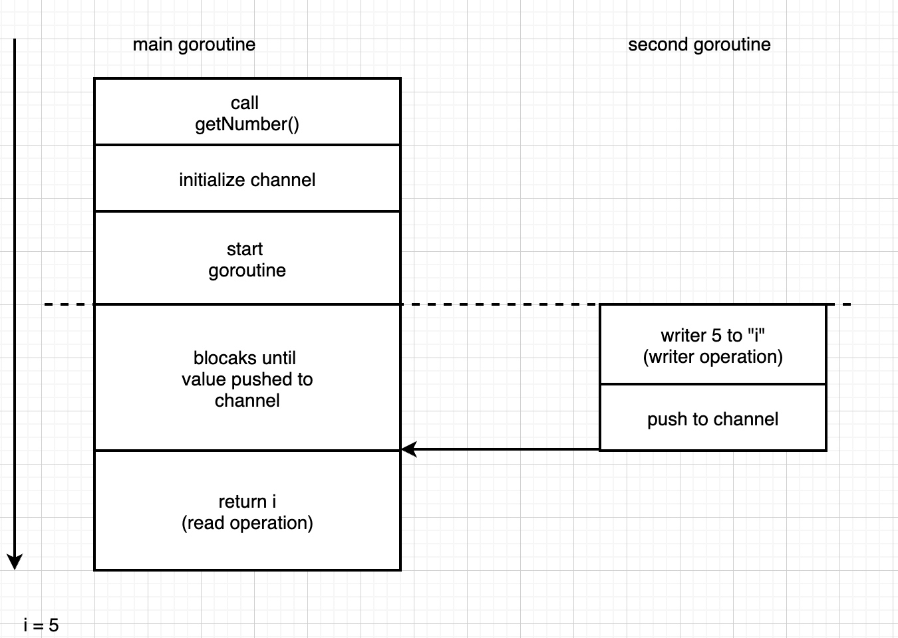
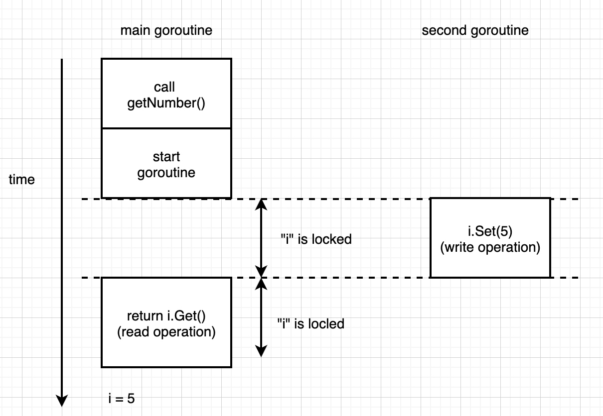
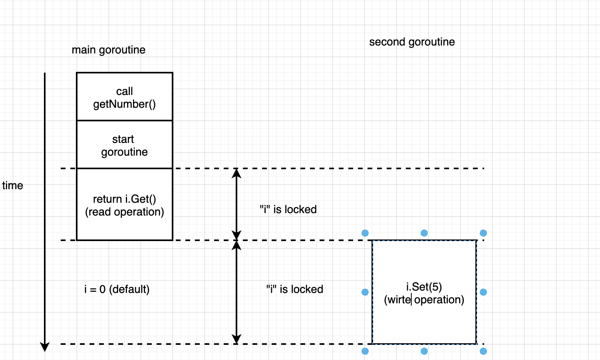

# 数据竞争

```go
import "fmt"

func main(){
    fmt.Println(getNumber())
}

func getNumber() int {
    var i int
    go func(){
        i =  5
    }()
    
    return i
}
```

解析：
    打印的结果为 0 或 5
 
 下面的两张图描述了返回值的两种可能的情况对应的时间线：
   

    
    



检测数据竞争

在较大的应用程序中，仅靠自己检查代码很难检测到数据竞争。幸运的是，Go(从V1.1开始)有一个内置的数据竞争检测器，我们可以使用它来确定应用程序里潜在的数据竞争条件。

使用它非常简单，只需在使用Go命令行工具时添加-race标志。例如，让我们尝试使用-race标志来运行我们刚刚编写的程序：

```sh
go run -race contend.go
```

输出结果：
```sh
0
==================
WARNING: DATA RACE
Write at 0x00c000132008 by goroutine 7:
  main.getNumber.func1()
      /Users/costalong/Documents/Code/Go/src/github.com/costa92/core/articale22/data/contend.go:14 +0x28

Previous read at 0x00c000132008 by main goroutine:
  main.getNumber()
      /Users/costalong/Documents/Code/Go/src/github.com/costa92/core/articale22/data/contend.go:16 +0x6c
  main.main()
      /Users/costalong/Documents/Code/Go/src/github.com/costa92/core/articale22/data/contend.go:8 +0x20

Goroutine 7 (running) created at:
  main.getNumber()
      /Users/costalong/Documents/Code/Go/src/github.com/costa92/core/articale22/data/contend.go:13 +0x60
  main.main()
      /Users/costalong/Documents/Code/Go/src/github.com/costa92/core/articale22/data/contend.go:8 +0x20
==================
Found 1 data race(s)
exit status 66

```
第一个0是打印结果(因此我们现在知道是操作2首先完成)。接下来的几行给出了在代码中检测到的数据竞争的信息。我们可以看到关于数据竞争的信息分为三个部分：

第一部分告诉我们，在getNumber函数里创建的goroutine中尝试写入（这是我们将值5赋给i的位置）
第二部分告诉我们，在主goroutine里有一个在同时进行的读操作。
第三部分描述了导致数据竞争的goroutine是在哪里被创建的。

除了go run命令外，go build和go test命令也支持使用-race标志。这个会使编译器创建的应用程序能够记录所有运行期间对共享变量访问，并且会记录下每一个读或者写共享变量的goroutine的身份信息。

竞争检查器会报告所有的已经发生的数据竞争。然而，它只能检测到运行时的竞争条件，并不能证明之后不会发生数据竞争。由于需要额外的记录，因此构建时加了竞争检测的程序跑起来会慢一些，且需要更大的内存，即使是这样，这些代价对于很多生产环境的工作来说还是可以接受的。对于一些偶发的竞争条件来说，使用附带竞争检查器的应用程序可以节省很多花在Debug上的时间。


检测功能 是 -race 

```sh
go build -race main.go
go install -race main.go
```

使用WaitGroup
解决数据竞争的最直接方法是（如果需求允许的情况下）阻止读取访问，直到写入操作完成：

```go
func getNumbers() int  {
	var i int
	// 初始化一个 waitGroup
	var wg sync.WaitGroup
	// Add(1) 通知程序有一个需要等待完成的任务
	wg.Add(1)
	go func() {
		i = 5
		// 调用 wg.Done 表示正在等待的程序已经执行完成了
		wg.Done()
	}()
	// wg.Wait 会阻塞当前程序直接到等待的程序都是执行完为止
	wg.Wait()
	return i
}
```

下面是使用WaitGroup后程序执行的时间线：




使用通道阻塞：

```go

// 使用通道阻塞
func getNumberChannel() int {
	var i int
	// 创建一个通道,在等待任务完成时会向通道发送一个空结构体
	done := make(chan struct{})
	go func() {
		i = 5
		// 执行完成后向通道发送一个空结构体
		done <- struct{}{}
	}()
	// 从通道接收值将会阻塞程序，直到有值发送给 done 通道为止
	<-done
	return i
}


```

下图是使用通道阻塞解决数据竞争后程序的执行流程：




使用Mutex

到目前为止，使用的解决方案只有在确定写入操作完成后再去读取i的值时才适用。现在让我们考虑一个更通常的情况，程序读取和写入的顺序并不是固定的，我们只要求它们不能同时发生就行。这种情况下我们应该考虑使用Mutex互斥锁。

```go
// 使用通道阻塞
func getNumberChannel() int {
	var i int
	// 创建一个通道,在等待任务完成时会向通道发送一个空结构体
	done := make(chan struct{})
	go func() {
		i = 5
		// 执行完成后向通道发送一个空结构体
		done <- struct{}{}
	}()
	// 从通道接收值将会阻塞程序，直到有值发送给 done 通道为止
	<-done
	return i
}

// SafeNumber 创建一个结构体包含想用互斥锁保护的值和一个 mutex 实例
type SafeNumber struct {
	val int
	m   sync.Mutex
}

func (i *SafeNumber) Get() int {
	i.m.Lock()
	defer i.m.Unlock()
	return i.val
}

func (i *SafeNumber) Set(val int)  {
	i.m.Lock()
	defer i.m.Unlock()
	i.val = val
}

func getNumberMutex() int {

	// 创建一个sageNumber 实例
	i := &SafeNumber{}
	// 使用Set 和 Get 代替常规赋值和读取操作
	// 现在可以确保只有在写入完成时才能读取

	go func() {
		i.Set(5)
	}()

	return i.Get()
}
```
下面两个图片对应于程序先获取到写锁和先获取到读锁两种可能的情况下程序的执行流程：

先获取到写锁时程序的执行流程




先获取读锁时程序的执行流程



Mutex vs Channel

使用互斥锁和通道两种方法解决并发程序的数据竞争问题。那么在什么情况使用互斥锁，什么时候使用通道？

大多数 Go 新手都是使用通道来解决所有的并发问题，因为 go 语言的一个很酷的特性。这种说法是不正确的。 语言提供了 Mutex 或 Channel 的选项，选择两种都可以


通常 当 goroutine 需要相互通信时使用通道，当确保同一时间只有一个 goroutine 能访问代码的关键部分时使用互斥锁，上面的例子中，倾斜使用 互斥锁 因为这个问题不需要goroutine之间的任何通信。只需要确保同一时间只有一个goroutine拥有共享变量的使用权，互斥锁本来就是为解决这种问题而生的，所以使用互斥锁是更自然的一种选择。