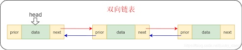

# 双向链表

## 定义
双向链表也叫做双链表，是链表的一种，它的每一个数据结点中都有两个指针，分别指向直接后继与直接前驱。 从双向链表中的任意一个结点开始，都可以很方便的访问前驱结点与后继结点，一般结构都是双向循环链表。

## 双向链表的结构如果下图：


双向链表需要额外的两个空间来存储后继结点和前驱结点的地址。所以，如果存储同样多的数据，双向链表要比单链表占用更多的内存空间。虽然两个指针比较浪费存储空间，但可以支持双向遍历，这样也带来了双向链表操作的灵活性。

使用go来实现代码：
```go
package bothway

import "fmt"

type Object interface {
}

type Node struct {
	Data Object
	Pre  *Node
	Next *Node
}

type DoubleList struct {
	headNode *Node
}

// 判断是否为空
func (dl *DoubleList) Empty() bool {
	if dl.headNode == nil {
		return true
	}
	return false
}

// 添加
func (dl *DoubleList) Add(data Object) {
	node := &Node{Data: data} // 新增加的节点
	cur := dl.headNode        // 当前的双链表
	if cur == nil {           // 是否有值
		dl.headNode = node // 赋值
	} else {
		for cur.Next != nil { // 循环处理一直找没有赋值的 next
			cur = cur.Next
		}
		node.Pre = cur  //  把当前的节点赋值给上个
		cur.Next = node // 当前的结点的下个结点赋值
	}
}

// 查询数量
func (dl *DoubleList) Len() int {
	count := 0
	cur := dl.headNode
	if cur != nil {
		for cur != nil {
			cur = cur.Next
			count++
		}
	}
	return count
}

// 正序打印
func (dl *DoubleList) ShowList() {
	cur := dl.headNode
	for cur != nil {
		fmt.Printf("\t %v", cur.Data)
		cur = cur.Next
	}
	fmt.Println()
}

// 倒序打印
func (dl *DoubleList) ShowListFromTail() {
	tail := dl.headNode
	for tail.Next != nil {
		tail = tail.Next
	}

	for tail != nil {
		fmt.Printf("\t %v", tail.Data)
		tail = tail.Pre
	}
}
// 移除一个结点
func (dl *DoubleList) RemoveNode(data Object) {
	cur := dl.headNode // 12,23; 23 是头
	if cur.Data == data {
		newHead := cur.Next
		newHead.Pre = nil
		dl.headNode = newHead
	} else {
		for cur != nil {
			if cur.Data == data {
				// 移除元素
				pre := cur.Pre   // 上个元素
				next := cur.Next // 下一个元素
				//当前节点被跳过, 会被当做垃圾回收掉
				next.Pre = pre //
				pre.Next = next
			}
			cur = cur.Next
		}
	}
}

```

官方已经实现双链：list 可以参考官网代码：[container/list](https://cs.opensource.google/go/go/+/refs/tags/go1.18.1:src/container/list/list.go;bpv=1)