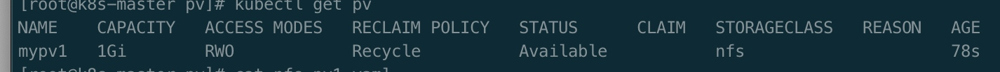
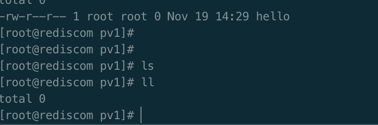
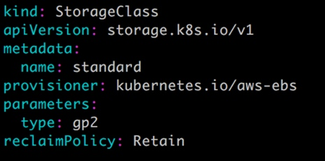
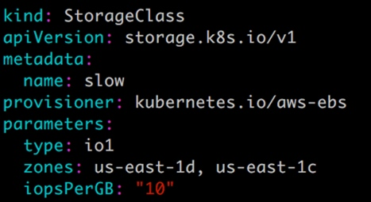

# nfs实现k8s持久化 

### 1. 部署nfs服务端

在任意一台服务器上安装

（1）安装nfs服务:

```bash
yum install -y nfs-utils rpcbind
vim /etc/exports
/nfsdata *(rw,no_root_squash,no_all_squash,sync)
```
（2）保存配置文件后，执行如下操作：
在服务端创建对应的目录和赋予权限：

```bash
 mkdir /nfsdata
 chmod 777 /nfsdata
```

（3） 启动rpcbind和nfs服务：

```bash
systemctl start rpcbind && systemctl enable rpcbind
systemctl start nfs && systemctl enable nfs
```

（4）每个node安装nfs工具

```bash
 yum install -y nfs-utils 
```
（5） 每个node查询NFS服务器

```bash
showmount -e nfs-ip
showmount -e 192.168.11.101
```

### NFS PersistentVolume
（1）下面创建一个 PV mypv1，配置文件 nfs-pv1.yml 如下：

```yaml
apiVersion: v1
kind: PersistentVolume
metadata:
  name: mypv1
spec:
  capacity:
    storage: 1Gi
  accessModes:
    - ReadWriteOnce
  persistentVolumeReclaimPolicy: Recycle
  storageClassName: nfs
  nfs:
    path: /data/NFS/k8s/pv1
    server: 192.168.11.101
```
① capacity 指定 PV 的容量为 1G。

② accessModes 指定访问模式为 ReadWriteOnce，支持的访问模式有：

ReadWriteOnce – PV 能以 read-write 模式 mount 到单个节点。

ReadOnlyMany – PV 能以 read-only 模式 mount 到多个节点。

ReadWriteMany – PV 能以 read-write 模式 mount 到多个节点。

③ persistentVolumeReclaimPolicy 指定当 PV 的回收策略为 Recycle，支持的策略有：

Retain – 需要管理员手工回收。

Recycle – 清除 PV 中的数据，效果相当于执行 rm -rf /thevolume/*。

Delete – 删除 Storage Provider 上的对应存储资源，例如 AWS EBS、GCE PD、Azure Disk、OpenStack Cinder Volume 等。

④ storageClassName 指定 PV 的 class 为 nfs。相当于为 PV 设置了一个分类，PVC 可以指定 class 申请相应 class 的 PV。

⑤ 指定 PV 在 NFS 服务器上对应的目录。

　　注意要做storage-provider段要提前建好文件夹

　注意要做storage-provider段要提前建好文件夹

```bash
[dev@rediscom k8s]$ ls
pv1
```

（2）创建 mypv1：

```bash
kubectl apply -f nfs-pv1.yaml
```
（3）查看 mypv1：
```bash
kubectl get pv
```


STATUS 为 Available，表示 mypv1 就绪，可以被 PVC 申请。

### 创建 PVC

(1）接下来创建 PVC mypvc1，配置文件 nfs-pvc1.yml 如下：

```yaml
kind: PersistentVolumeClaim
apiVersion: v1
metadata:
  name: mypvc1
spec:
  accessModes:
    - ReadWriteOnce
  resources:
    requests:
      storage: 1Gi
  storageClassName: nfs
```

PVC 就很简单了，只需要指定 PV 的容量，访问模式和 class。

（2）创建 mypvc1：

```bash
[root@k8s-master pvc]# kubectl apply -f nfs-pvc1.yml
persistentvolumeclaim/mypvc1 created
[root@k8s-master pvc]# kubectl get pvc
NAME     STATUS   VOLUME   CAPACITY   ACCESS MODES   STORAGECLASS   AGE
mypvc1   Bound    mypv1    1Gi        RWO            nfs            11s
```
从 kubectl get pvc 和 kubectl get pv 的输出可以看到 mypvc1 已经 Bound 到 mypv1，申请成功。

### Pod使用pvc

（1）接下来就可以在 Pod 中使用存储了，Pod 配置文件 pod1.yml 如下：

```yaml
apiVersion: v1
kind: Pod
metadata:
  name: mypod1
spec:
  containers:
    - name: mypod1
      image: busybox
      args:
      - /bin/sh
      - -c
      - sleep 30000
      volumeMounts:
      - mountPath: "mydata"
        name: mydata
  volumes:
    - name: mydata
      persistentVolumeClaim:
        claimName: mypvc1
```

与使用普通 Volume 的格式类似，在 volumes 中过 persistentVolumeClaim 指定使用 mypvc1 申请的 Volume。

（2）创建 mypod1：

```bash
[root@k8s-master pod]# kubectl apply -f pod1.yaml
pod/mypod1 created
[root@k8s-master pod]# kubectl get pod -o wide
NAME                     READY   STATUS              RESTARTS   AGE     IP              NODE        NOMINATED NODE   READINESS GATES
mypod1                   0/1     ContainerCreating   0          20s     <none>          k8s-node4   <none>           <none>
nginx-58dcb77688-h8c5x   1/1     Running             0          3d23h   172.31.156.68   k8s-node1   <none>           <none>
```
（3）验证 PV 是否可用：

```bash
kubectl exec mypod1 touch /mydata/hello
```
查看生成文件
```bash
[root@rediscom ~]# cd /data/NFS/k8s/pv1/
[root@rediscom pv1]# ls
hello
```

　　可见，在 Pod 中创建的文件 /mydata/hello 确实已经保存到了 NFS 服务器目录 /nfsdata/pv1 中。

　　如果不再需要使用 PV，可用删除 PVC 回收 PV。


### 3. 回收 PV
通过pvc回收pv
（1）当 PV 不再需要时，可通过删除 PVC 回收。

```bash
[root@k8s-master pvc]# kubectl get pvc
NAME     STATUS   VOLUME   CAPACITY   ACCESS MODES   STORAGECLASS   AGE
mypvc1   Bound    mypv1    1Gi        RWO            nfs            22m
# 删除pvc
[root@k8s-master pvc]# kubectl delete pvc mypvc1
persistentvolumeclaim "mypvc1" deleted
```

当 PVC mypvc1 被删除后，发现 Kubernetes 启动了一个新 Pod，这个 Pod 的作用就是清除 PV mypv1 的数据。这个时候再看 NFS 服务器目录 /data/NFS/k8s/pv1/ 中已经没有数据了




**注意:** 删除 mypvc1 时之前要停止与它相关的 pod ，不然 mypvc1一直处于 Terminating 状态

（2）当数据清除完毕，mypv1 的状态重新变为 Available，此时则可以被新的 PVC 申请。

```bash
[root@k8s-master pvc]# kubectl get pv
NAME    CAPACITY   ACCESS MODES   RECLAIM POLICY   STATUS      CLAIM   STORAGECLASS   REASON   AGE
mypv1   1Gi        RWO            Recycle          Available           nfs                     67m
```

（3）因为 PV 的回收策略设置为 Recycle，所以数据会被清除，但这可能不是我们想要的结果。如果我们希望保留数据，可以将策略设置为 Retain。

```yaml
apiVersion: v1
kind: PersistentVolume
metadata:
  name: mypv1
spec:
  capacity:
    storage: 1Gi
  accessModes:
    - ReadWriteOnce
  persistentVolumeReclaimPolicy: Retain
  storageClassName: nfs
  nfs:
    path: /data/NFS/k8s/pv1
    server: 192.168.11.101
```     
（4）通过 kubectl apply 更新 PV：
```bash
[root@k8s-master pv]# kubectl apply -f nfs-pv1.yaml
persistentvolume/mypv1 configured
[root@k8s-master pv]# kubectl get pv
NAME    CAPACITY   ACCESS MODES   RECLAIM POLICY   STATUS      CLAIM   STORAGECLASS   REASON   AGE
mypv1   1Gi        RWO            Retain           Available           nfs                     81m
[root@k8s-master pv]#
```

（5）回收策略已经变为 Retain，通过下面步骤验证其效果：

```yaml
[root@k8s-master pvc]# kubectl exec mypod1 touch /mydata/hello
kubectl exec [POD] [COMMAND] is DEPRECATED and will be removed in a future version. Use kubectl exec [POD] -- [COMMAND] instead.
error: unable to upgrade connection: container not found ("mypod1")
[root@k8s-master pvc]# kubectl get pod
NAME                     READY   STATUS    RESTARTS   AGE
mypod1                   1/1     Running   0          27s
nginx-58dcb77688-h8c5x   1/1     Running   0          4d
[root@k8s-master pvc]# kubectl exec mypod1 touch /mydata/hello
kubectl exec [POD] [COMMAND] is DEPRECATED and will be removed in a future version. Use kubectl exec [POD] -- [COMMAND] instead.
[root@k8s-master pvc]# kubectl delete -f ../pod/pod1.yaml
pod "mypod1" deleted
[root@k8s-master pvc]# kubectl get pvc
NAME     STATUS   VOLUME   CAPACITY   ACCESS MODES   STORAGECLASS   AGE
mypvc1   Bound    mypv1    1Gi        RWO            nfs            3m48s
[root@k8s-master pvc]# kubectl delete pvc mypvc1
persistentvolumeclaim "mypvc1" deleted
[root@k8s-master pvc]# kubectl get pvc
No resources found in default namespace.
[root@k8s-master pvc]#
```

（6）我们再看 NFS 服务器目录 /nfsdata/pv1 中数据还保留。

```bash
[root@rediscom pv1]# ls
hello
[root@rediscom pv1]#
```

（7）虽然 mypv1 中的数据得到了保留，但其 PV 状态会一直处于 Released，不能被其他 PVC 申请。
```bash
[root@k8s-master pvc]# kubectl get pv
NAME    CAPACITY   ACCESS MODES   RECLAIM POLICY   STATUS     CLAIM            STORAGECLASS   REASON   AGE
mypv1   1Gi        RWO            Retain           Released   default/mypvc1   nfs                     89m
```

8）为了重新使用存储资源，可以删除并重新创建 mypv1。删除操作只是删除了 PV 对象，存储空间中的数据并不会被删除。

新建的 mypv1 状态为 Available，已经可以被 PVC 申请。
```bash
[root@k8s-master pvc]# kubectl delete pv mypv1
[root@k8s-master pvc]# ubectl apply -f nfs-pv1.yaml
[root@k8s-master pvc]# kubectl get pv
NAME    CAPACITY   ACCESS MODES   RECLAIM POLICY   STATUS      CLAIM   STORAGECLASS   REASON   AGE
mypv1   1Gi        RWO            Retain           Available           nfs                     2s
[root@k8s-master pvc]#
```

PV 还支持 Delete 的回收策略，会删除 PV 在 Storage Provider 上对应存储空间。NFS 的 PV 不支持 Delete，支持 Delete 的 Provider 有 AWS EBS、GCE PD、Azure Disk、OpenStack Cinder Volume 等

### 4.  PV的动态供给 
pv的供给方式

前面的例子中，我们提前创建了 PV，然后通过 PVC 申请 PV 并在 Pod 中使用，这种方式叫做静态供给（Static Provision）。

与之对应的是动态供给（Dynamical Provision），即如果没有满足 PVC 条件的 PV，会动态创建 PV。相比静态供给，动态供给有明显的优势：不需要提前创建 PV，减少了管理员的工作量，效率高。

动态供给是通过 StorageClass 实现的，StorageClass 定义了如何创建 PV


pv动态供给举例
StorageClass standard：



StorageClass slow：



　这两个 StorageClass 都会动态创建 AWS EBS，不同在于 standard 创建的是 gp2 类型的 EBS，而 slow 创建的是 io1 类型的 EBS。不同类型的 EBS 支持的参数可参考 AWS 官方文档。

StorageClass 支持 Delete 和 Retain 两种 reclaimPolicy，默认是 Delete。

与之前一样，PVC 在申请 PV 时，只需要指定 StorageClass 和容量以及访问模式，比如：

 ```yaml
 kind: PersistentVolumeClaim
apiVersion: v1
metadata:
  name: mypvc1
spec:
  accessModes:
    - ReadWriteOnce
  resources:
    requests:
      storage: 1Gi
  storageClassName: standard
 ```

　　除了 AWS EBS，Kubernetes 支持其他多种动态供给 PV 的 Provisioner，完整列表请参考 https://kubernetes.io/docs/concepts/storage/storage-classes/#provisioner