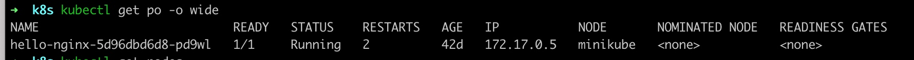
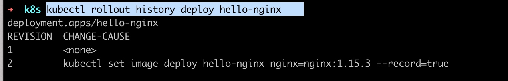

# deployment 定义

### 1.1 概念

用于部署无状态的服务，这个最常用的控制器。一般用于管理维护企业内部无状态的微服务，比如 configserver、zuul、springboot，它可以管理多个副本的 Pod 实现无缝迁移、自动扩容、缩容、自动灾难恢复、一键回滚等功能。

### 1.2 创建一个 Deployment
```sh
kubectl create deployment hello-nginx --image=nginx:latest
```
查看 Deployment 文件内容

```yaml
apiVersion: apps/v1
kind: Deployment
metadata:
  annotations:
    deployment.kubernetes.io/revision: "1"
  creationTimestamp: "2022-03-22T16:12:13Z"
  generation: 1
  labels:
    app: hello-nginx
  name: hello-nginx
  namespace: default
  resourceVersion: "57906"
  uid: 5b087149-aa3f-4453-8908-0ad570f056c8
spec:
  progressDeadlineSeconds: 600
  replicas: 1  # 副本数量
  revisionHistoryLimit: 10  # 
  selector:
    matchLabels:
      app: hello-nginx
  strategy:
    rollingUpdate:
      maxSurge: 25%
      maxUnavailable: 25%
    type: RollingUpdate
  template:
    metadata:
      creationTimestamp: null
      labels:
        app: hello-nginx
    spec:
      containers:
      - image: nginx:latest
        imagePullPolicy: Always
        name: nginx
        resources: {}
        terminationMessagePath: /dev/termination-log
        terminationMessagePolicy: File
      dnsPolicy: ClusterFirst
      restartPolicy: Always
      schedulerName: default-scheduler
      securityContext: {}
      terminationGracePeriodSeconds: 30
status:
  availableReplicas: 1
  conditions:
  - lastTransitionTime: "2022-03-22T16:12:13Z"
    lastUpdateTime: "2022-03-22T16:12:42Z"
    message: ReplicaSet "hello-nginx-5d96dbd6d8" has successfully progressed.
    reason: NewReplicaSetAvailable
    status: "True"
    type: Progressing
  - lastTransitionTime: "2022-05-04T07:24:10Z"
    lastUpdateTime: "2022-05-04T07:24:10Z"
    message: Deployment has minimum availability.
    reason: MinimumReplicasAvailable
    status: "True"
    type: Available
  observedGeneration: 1
  readyReplicas: 1
  replicas: 1
  updatedReplicas: 1
```
### 查看 pods label

```sh
kubectl get po --show-labels
```

**注意**：spec.selector.matchLabels 下面的标签要与 spec.template.metadata.labels 的值一样的，否则是无法创建成功的

spec.selector.matchLabels 这个是匹配 ReplicaSet
spec.template.metadata.labels 这个是匹配 pod

spec.selector.matchLabels 与 spec.template.metadata.labels 是否无法修改，如果修改，会导致无法管理历史的 Deployment


### 状态解析：


NAME: Deployment 名称
READY: Pod 的状态，已经 Ready 的个数
UP-TO-DATE： 已经达到期望状态的被更新的副本数
AVALABLE: 已经可以用的副本数
AGE： 显示应用程序的运行的时间
CONTAINERS: 容器名字
IMAGES: 容器的镜像
SELECTOR: 管理的Pod 的标签

### 查看标签

```sh
kubectl get po --show-labels
```

### 查看镜像信息
```sh
kubectl get deployment hello-nginx -oyaml |grep image
```

### 更新镜像命令执行
```sh
kubectl set image deploy hello-nginx nginx=nginx:1.15.3 --record
```
把 deploy 的 hello-nginx 的nginx镜像改成：nginx:1.15.3
--record 是保存记录，后期可以查看修改的参数

### 查看回滚的状态
```sh
kubectl rollout status deploy hello-nginx
```

### 查看老的 rs
```sh
kubectl get rs hello-nginx-5d96dbd6d8 -oyaml
```
```sh
 kubectl get rs hello-nginx-6859bb4f57 -oyaml
```

### 查看历史的版本
```sh
kubectl rollout history deploy hello-nginx
```


### 回滚到上个版本
```sh
kubectl rollout undo deploy hello-nginx
// 查看镜像的
kubectl get deployment hello-nginx -oyaml |grep image
```

### 查看指定版本的详细信息
```sh
kubectl rollout history deploy hello-nginx --revision=2
```

### 回滚到指定版本
```sh
kubectl rollout undo deploy hello-nginx --to-revision=2
```

### 使用 scale 进行扩容
```sh
kubectl scale --replicas=3 deploy hello-nginx
```
### 使用 scale 进行缩容
```sh
kubectl scale --replicas=1 deploy hello-nginx
```
### Deployment 暂停与恢复功能
```sh
kubectl rollout pause deployment hello-nginx
# 第一次修改
kubectl set image deploy hello-nginx nginx=nginx:1.15.1 --record
# 第二次修改
## 添加内存与cpu
kubectl set resources deploy hello-nginx -c nginx --limits=cpu=200m,memory=128Mi --requests=cpu=10m,memory=16Mi
# 恢复deployment
kubectl rellout resume deploy hello-nginx 
```

### Deployment 注意的配置
**spec.revisionHistoryLimit**: 设置保留RS的旧的 revision 的个数，如果设置为 0 的话，不保留历史的数据
**spec.minReadySeconds**: 可选参数， 指定新创建的Pod在没有任何容器崩溃的视情况下视为：Ready 最小的秒数，默认为0，即一旦被创建就视为可用

**滚动更新的策略**：

    spec.strategy.type: 更新 deployment 的方式，默认是 RollingUpdate
        RollingUpdate： 滚动更新，可以指定 MaxSurge 和 MaxUnavailable
            MaxUnavailable： 指定在回滚或更新时最大不可用的 Pod 的数量。可选字段。默认是为：25%，可以设置数字与百分比，如果该值为0 ，那么MaxSurge 就不能为 0
            MaxSurge：可以超过期望值的最大Pod数，可选字段。默认为25%，可以设置数字与百分比,如果该值为0，那么MaxUnavailable不能为0
        Recreate： 重建，先删除旧的Pod，再创建新的Pod    


参考文档： [https://kubernetes.io/zh/docs/concepts/workloads/controllers/deployment](https://kubernetes.io/zh/docs/concepts/workloads/controllers/deployment/)