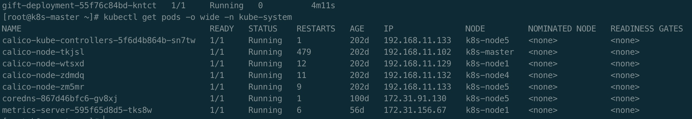

# k8s-1.20之containerd配置--使用个人harbor仓库

## 背景

k8s-1.20发布之后，不再使用doker作为底层容器运行时，而是默认使用Container Runtime Interface(CRI)。因此原来在docker中配置的个人仓库环境不再 起作用，导致k8s配置pods时拉取镜像失败。

## 配置方式

查看环境

查看是否已经采用containerd作为容器运行时。
```bash
kubectl get pods -o wide -n kube-system
```



通过查看版本

``` bash
ctr -v
# ctr containerd.io 1.4.3
```

生产默认配置文件夹  # 注意 如果存在该文件需要备份 /etc/containerd/config.toml

```bash
containerd config default > /etc/containerd/config.toml
```

修改config.toml 文件

```bash
[plugins."io.containerd.grpc.v1.cri".registry]
   [plugins."io.containerd.grpc.v1.cri".registry.mirrors]
       [plugins."io.containerd.grpc.v1.cri".registry.mirrors."docker.io"]
          		endpoint = ["https://registry-1.docker.io"] //到此为配置文件默认生成，之后为需要添加的内容
       [plugins."io.containerd.grpc.v1.cri".registry.mirrors."192.168.11.130"]
         		endpoint = ["http://192.168.11.130"]
   [plugins."io.containerd.grpc.v1.cri".registry.configs]
   		 [plugins."io.containerd.grpc.v1.cri".registry.configs."192.168.11.130".tls]
          		insecure_skip_verify = true
       	 [plugins."io.containerd.grpc.v1.cri".registry.configs."192.168.11.130".auth]
          		username = "costalong"
          		password = "Long12345"
```


```bash
    [plugins."io.containerd.grpc.v1.cri".registry]
      [plugins."io.containerd.grpc.v1.cri".registry.mirrors]
        [plugins."io.containerd.grpc.v1.cri".registry.mirrors."docker.io"]
          endpoint = ["https://registry-1.docker.io"]
        [plugins."io.containerd.grpc.v1.cri".registry.mirrors."192.168.11.130"]
          endpoint = ["http://192.168.11.130"]
      [plugins."io.containerd.grpc.v1.cri".registry.configs]
         [plugins."io.containerd.grpc.v1.cri".registry.configs."192.168.11.130".tls]
                insecure_skip_verify = true
         [plugins."io.containerd.grpc.v1.cri".registry.configs."192.168.11.130".auth]
                username = "constalong"
                password = "Long12345"
    [plugins."io.containerd.grpc.v1.cri".image_decryption]
    ```
    
注意     
insecure_skip_verify = true 意为跳过证书认证。

保存并重启containerd服务即可
systemctl restart containerd