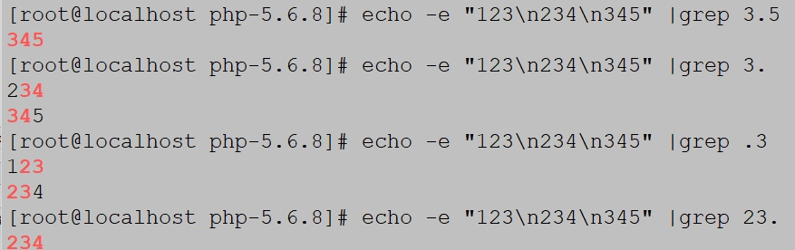
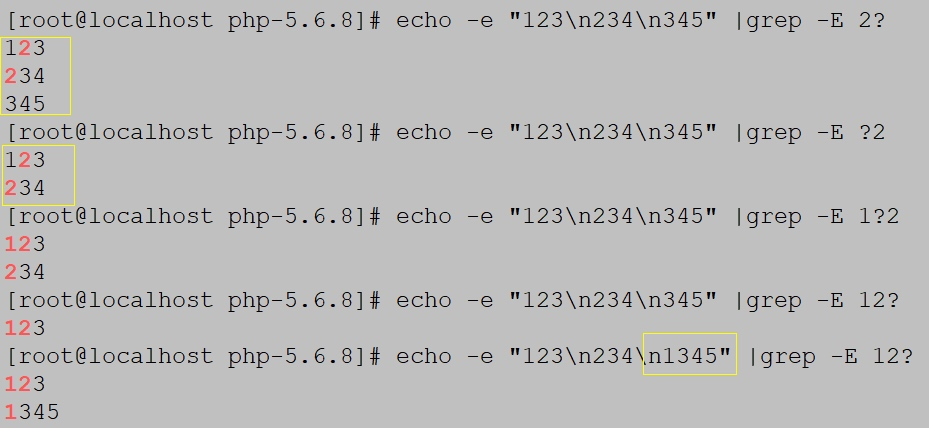
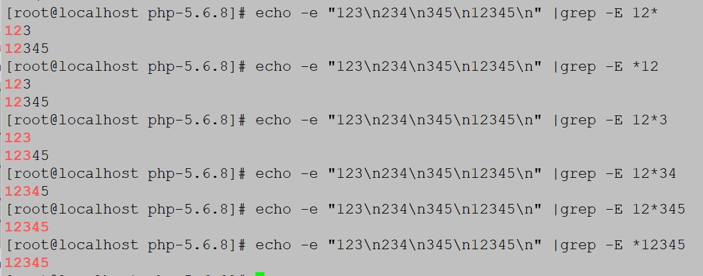
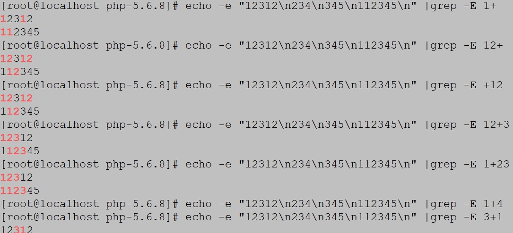

# ingress-nginx

参考连接：
https://kubernetes.github.io/ingress-nginx/

## ingress

### Deployment
**annotation**

Rewriting can be controlled using the following annotations:

| Name                                           | Description                                                                                                         | Values |
|------------------------------------------------|---------------------------------------------------------------------------------------------------------------------|--------|
| nginx.ingress.kubernetes.io/rewrite-target     | Target URI where the traffic must be redirected                                                                     | string |
| nginx.ingress.kubernetes.io/ssl-redirect       | Indicates if the location section is only accessible via SSL (defaults to True when Ingress contains a Certificate) | bool   |
| nginx.ingress.kubernetes.io/force-ssl-redirect | Forces the redirection to HTTPS even if the Ingress is not TLS Enabled                                              | bool   |
| nginx.ingress.kubernetes.io/app-root           | Defines the Application Root that the Controller must redirect if it's in / context                                 | string |
| nginx.ingress.kubernetes.io/use-regex          | 	Indicates if the paths defined on an Ingress use regular expressions                                               | bool   |


### Examples

重写指定目标(rewrite-target),创建一个 ingress 重写规则的annotation：

```yaml
apiVersion: networking.k8s.io/v1
kind: Ingress
metadata:
  annotations:
    nginx.ingress.kubernetes.io/rewrite-target: /$2
  name: rewrite  // ingress 名字
  namespace: default  // 指定空间
spec:
  ingressClassName: nginx
  rules:
  - host: rewrite.bar.com  // 域名
    http:
      paths:
      - path: /something(/|$)(.*)
        pathType: Prefix
        backend:
          service:
            name: http-svc
            port: 
              number: 80  // 服务端口号
```
这个例子,这个 ingress 定义将遵循结果以下重写
```sh
rewrite.bar.com/something rewrites to rewrite.bar.com/
rewrite.bar.com/something/ rewrites to rewrite.bar.com/
rewrite.bar.com/something/new rewrites to rewrite.bar.com/new
```

Create an Ingress rule with an app-root annotation:

```yaml
apiVersion: networking.k8s.io/v1
kind: Ingress
metadata:
  annotations:
    nginx.ingress.kubernetes.io/app-root: /app1
  name: approot
  namespace: default
spec:
  ingressClassName: nginx
  rules:
  - host: approot.bar.com
    http:
      paths:
      - path: /
        pathType: Prefix
        backend:
          service:
            name: http-svc
            port: 
              number: 80
```


## 常用正则表达式：
　

| 字符 | 描述 |
| --- | --- |
| \ | 将后面接着的字符标记为一个特殊字符或者一个原义字符或一个向后引用  | 
| ^ | 匹配输入字符串的起始位置 |
| $ | 匹配输入字符串的结束位置 |
| * | 匹配前面的字符零次或者多次 |
| + | 匹配前面字符串一次或者多次 |
| ? | 匹配前面字符串的零次或者一次 |
| . | 匹配除“\n”之外的所有单个字符 |
|(pattern)| 匹配括号内的pattern |

rewrite 最后一项flag参数：

| 标记符号 | 说明 |
| --- | --- |
| last | 本条规则匹配完成后继续向下匹配新的location URI规则 |
| break | 本条规则匹配完成后终止，不在匹配任何规则|
| redirect | 返回302临时重定向 |
| permanent | 返回301永久重定向 |

1. 基础知识点
（1）Rewirte规则也称为 规则重写，主要功能是实现浏览器访问HTTP URL的跳转，其正则表达式是基于Perl语言。

（2）对收缩引擎优化（SEO），利于收索引擎抓取网站页面。

（3）隐藏网站URL真实地址。

（4）网站变更升级，可以基于Rewrite临时重定向到其他页面。

（5）有利于服务器实现伪静态。

2. Rewrite结尾表示符
 
（1）last：相当于apache里的（L）标记，表示完成rewrite匹配。（浏览器地址栏URL地址不变）

（2）break：本条规则匹配完成后，终止匹配，不再匹配后面的规则。（浏览器地址栏URL地址不变）

（3）redirect：返回302临时重定向，浏览器地址栏会显示跳转后的URL地址。

（4）permanent：返回301永久重定向，浏览器地址栏会显示跳转后的URL地址。

3. Rewrite规则常用表达式
（1） .    匹配任何单字符；




（2）？ 匹配0到1个字符；只匹配一次；



（3）*   匹配0到多个字符；



（4）+  匹配1到多个字符；



（5）[0-9]  匹配字符串0-9

![[0-9]  匹配字符串0-9](media/16482752702273.jpg)

（6）[^0-9] 不匹配字符串0-9
![[^0-9] 不匹配字符串0-9](media/16482752909179.jpg)

（7）^  字符串开始标志
（8）$ 字符串结束标志
（9）\n 转义换行标志

4、Nginx Rewrite变量常用于匹配HTTP请求头信息、浏览器主机名、URL等。

5、Rewrite配置在nginx的location块中的配置

（1）将dks.net跳转至www.dks.net
```sh
if($host='dks.net')    {
    rewrite ^/(.*)$    http://www.dks.net/$1     permanent;
    }
    
# $host内置nginx变量，匹配用户访问的域名
# $1表示引用第一个括号的内容，是用户输入的内容；如果不使用$1引用，则只会匹配根

正则匹配的参数，$1表示第一个()内的正则匹配内容，$2为第二个，以此类推
```
（2）将访问www.dks.net/跳转至www.test.com/new.index.html
```sh
rewrite    ^/$    http://www.test.com/new.index.html     permanent;
```
（3）访问 /dks/test01/跳转至/newindex.html,浏览器地址不变
```sh
rewrite    ^/dks/test01/$    /newindex.html    last;
```
（4）多域名跳转 www.dks.net
```sh
if($host!='www.dks.net')    {
    rewrite    ^/(.*)$    http://www.dks.net/$1    permanert;
    }
```
（5）访问文件和目录不存在跳转至index.php

　　！-f 和 -f 判断文件
　　！-d 和 -d 判断目录
　　！-e 和 -e 判断文件和目录
　　！-x 和 -x 判断文件是否可执行
　　
```sh
if(!-e    $request filename)    {
    rewrite    ^/(.*)    /index.php    last;
}
```

6）目录对换 /xxx/123456——> /xxx?id=123456
　　\d+ 代表匹配数字，相当于[0-9]
```sh
rewrite    ^/(.+)/(\d+)    /$1?id=$2    last;
```
（7）判断浏览器User Agent跳转
```sh
if($http_user_agent    ~MSIE)    {
    rewrite ^(.*)$/ie/$1  break;
    }
```
（8）禁止访问以.sh | .flv  |  .mps为文件后缀的文件
```sh
location ~.*\.(sh|flv|mp3)$    {
    return 403;
    }
```
（9）将移动用户访问跳动至移动端。
```sh
if($http_user_agent ~*  "(Android)|(iphone)|(Mobile)|(WAP)|(UCWEB)")    {
    rewrite ^/$    http://m.dks.net/    permanent;
    }
```

（10）匹配URL访问字符串跳转
```sh
if($args ~* tid=13)    {
    return 404;
    }
```

（11）访问/10690/dks/123  跳转至/index.php?tid/10690/items=123
```sh
rewrite    ^/([0-9]+)/dks/(.+)$    /index.php?tid/$1/items=$2    last;
```
 6、多rewrite规则跳转
 ```sh
 rewrite ^/dks/(.*)/$ /newindex.html permanent;　　#可以跳转
rewrite ^/newindex.html$ /dks/test01/index.html permanent;
 ```
 ```sh
 rewrite ^/dks/(.*)/$ /newindex.html break;　　　　#break 终止跳转，执行下一条rewrite规则
rewrite ^/newindex.html$ /dks/test01/index.html permanent;
 ```
```sh
rewrite ^/dks/(.*)/$ /newindex.html last;　　　　#last　　跳转，但下面那条rewrite规则匹配不上，因为last使地址栏url地址不变，所以下面的那条rewrite规则匹配不上；
rewrite ^/newindex.html$ /dks/test01/index.html permanent;    #此条规则匹配不上上边的url地址
```


参考文档：
[GitHub](https://github.com/kubernetes/ingress-nginx/blob/main/docs/examples/rewrite/README.md)

[Kubernetes Ingress-nginx高级用法](https://blog.csdn.net/heian_99/article/details/115017473)