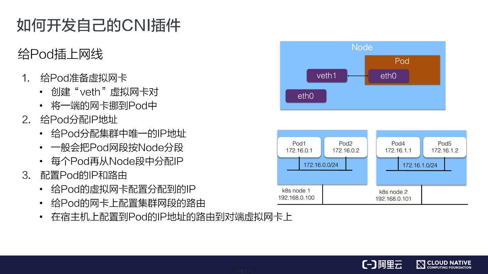

#  如何开发自己的 CNI 插件

有时社区的插件无法满足自己的需求，比如在阿里云上只能使用 vxlan 这种 Overlay 的插件，而 Overlay 插件的性能相对较差，无法满足阿里云上的一些业务需求，所以阿里云上开发了一个 Terway 的插件。

如果我们自己的环境比较特殊，在社区里面又找不到合适的网络插件，此时可以开发一个自己的 CNI 插件。

CNI 插件的实现通常包含两个部分：

1. 一个二进制的 CNI 插件去配置 Pod 网卡和 IP 地址。这一步配置完成之后相当于给 Pod 上插上了一条网线，就是说它已经有自己的 IP、有自己的网卡了；
2. 一个 Daemon 进程去管理 Pod 之间的网络打通。这一步相当于说将 Pod 真正连上网络，让 Pod 之间能够互相通信。

## 给 Pod 插上网线

那么如何实现第一步，给 Pod 插上网线呢？通常是这样一个步骤：

### 1. 给 Pod 准备一个网卡

通常我们会用一个 “veth” 这种虚拟网卡，一端放到 Pod 的网络空间，一端放到主机的网络空间，这样就实现了 Pod 与主机这两个命名空间的打通。

### 2. 给 Pod 分配 IP 地址

这个 IP 地址有一个要求，我们在之前介绍网络的时候也有提到，就是说这个 IP 地址在集群里需要是唯一的。如何保障集群里面给 Pod 分配的是个唯一的 IP 地址呢？

一般来说我们在创建整个集群的时候会指定 Pod 的一个大网段，按照每个节点去分配一个 Node 网段。比如说上图右侧创建的是一个 172.16 的网段，我们再按照每个节点去分配一个 /24 的段，这样就能保障每个节点上的地址是互不冲突的。然后每个 Pod 再从一个具体的节点上的网段中再去顺序分配具体的 IP 地址，比如 Pod1 分配到了 172.16.0.1，Pod2 分配到了 172.16.0.2，这样就实现了在节点里面 IP 地址分配的不冲突，并且不同的 Node 又分属不同的网段，因此不会冲突。

这样就给 Pod 分配了集群里面一个唯一的 IP 地址。

### 3. 配置 Pod 的 IP 和路由

- 第一步，将分配到的 IP 地址配置给 Pod 的虚拟网卡；
- 第二步，在 Pod 的网卡上配置集群网段的路由，令访问的流量都走到对应的 Pod 网卡上去，并且也会配置默认路由的网段到这个网卡上，也就是说走公网的流量也会走到这个网卡上进行路由；
- 最后在宿主机上配置到 Pod 的 IP 地址的路由，指向到宿主机对端 veth1 这个虚拟网卡上。这样实现的是从 Pod 能够到宿主机上进行路由出去的，同时也实现了在宿主机上访问到 Pod 的 IP 地址也能路由到对应的 Pod 的网卡所对应的对端上去。

## 给 Pod 连上网络

刚才我们是给 Pod 插上网线，也就是给它配了 IP 地址以及路由表。那怎么打通 Pod 之间的通信呢？也就是让每一个 Pod 的 IP 地址在集群里面都能被访问到。

一般我们是在 CNI Daemon 进程中去做这些网络打通的事情。通常来说是这样一个步骤：

- 首先 CNI 在每个节点上运行的 Daemon 进程会学习到集群所有 Pod 的 IP 地址及其所在节点信息。学习的方式通常是通过监听 K8s APIServer，拿到现有 Pod 的 IP 地址以及节点，并且新的节点和新的 Pod 的创建的时候也能通知到每个 Daemon；
- 拿到 Pod 以及 Node 的相关信息之后，再去配置网络进行打通。
  - 首先 Daemon 会创建到整个集群所有节点的通道。这里的通道是个抽象概念，具体实现一般是通过 Overlay 隧道、阿里云上的 VPC 路由表、或者是自己机房里的 BGP 路由完成的；
  - 第二步是将所有 Pod 的 IP 地址跟上一步创建的通道关联起来。关联也是个抽象概念，具体的实现通常是通过 Linux 路由、fdb 转发表或者OVS 流表等完成的。Linux 路由可以设定某一个 IP 地址路由到哪个节点上去。fdb 转发表是 forwarding database 的缩写，就是把某个 Pod 的 IP 转发到某一个节点的隧道端点上去（Overlay 网络）。OVS 流表是由 Open vSwitch 实现的，它可以把 Pod 的 IP 转发到对应的节点上。

