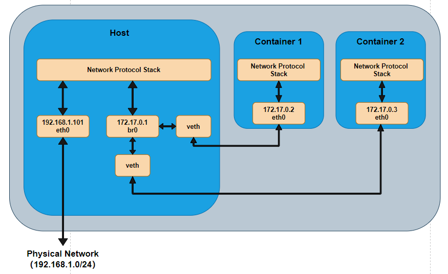
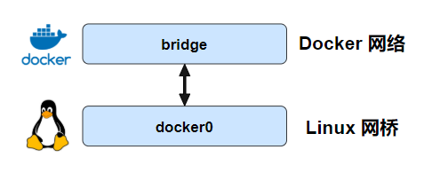

# docker 跨主机网络

 Docker 有若干驱动，通常被称为原生驱动或本地驱动。 eg: Birdge Drive, Host Driver 、 Overlay Driver 、 MacLan Driver 、 None Dirver

 Docker远程驱动网络分为: macvlan、flannel、weave、calico、


Bridge Docker 容器的默认网络驱动，通过网桥来实现网络通讯。

Overlay 借助 Docker 集群模块 Docker Swarm 搭建的跨 Docker Daemon 网络。 通过它可以搭建跨物理网络主机的虚拟网络，进而让不同物理机中运行的容器感知不到多个物理机的存在。


### **桥接网络**

**Docker 的 bridge 网络采用内置的 bridge 驱动，而 bridge 的底层采用的是** **Linux** **内核中 Linux bridge 技术**（这意味着 bridge 是高性能并且是非常稳定的）。



而默认的 bridge 网络是被映射到内核中为 docker0 的网桥上

```sh
ip link show docker0

3: docker0: <BROADCAST,MULTICAST,UP,LOWER_UP> mtu 1500 qdisc noqueue state UP mode DEFAULT group default
    link/ether 02:42:a9:fb:64:e1 brd ff:ff:ff:ff:ff:ff
```

```sh
docker network inspect bridge | grep bridge.name
            "com.docker.network.bridge.name": "docker0",
```

Docker 默认的 bridge 网络和 Linux 内核中的 “docker0” 网桥是一个对应关系，如图所示。bridge 是 Docker 中对网络的命名，而 docker0 是内核中网桥的名字。（个人理解：你就可以把 bridge 和 docker0 当成 Linux 网桥的两个名字，两个都是代表同一个东西。docker 为了管理网络，又给 docker0 这个网桥取名为 bridge）。



####  **创建新的单机桥接网络**

```sh
docker network create -d bridge localnet
```

通过 brctl 工具来查看系统中的 Linux 网桥

```sh
brctl show
输出：
bridge name     bridge id               STP enabled     interfaces
br-88db1179ad8c         8000.0242740c2062       no              veth5fcf2e9
br-fc18e852c0e3         8000.0242db4191c5       no
docker0         8000.0242a9fb64e1       no              veth0eacc92
                                                        veth9e8dd8a
                                                        vethe58a1ff
```

interfaces  接入的设备的信息 

通过 ifconfig  查询 网卡设备信息

```sh
ifconfig veth0eacc92
输出：
veth0eacc92: flags=4163<UP,BROADCAST,RUNNING,MULTICAST>  mtu 1500
        inet6 fe80::ec8c:25ff:fe0d:5927  prefixlen 64  scopeid 0x20<link>
        ether ee:8c:25:0d:59:27  txqueuelen 0  (以太网)
        RX packets 0  bytes 0 (0.0 B)
        RX errors 0  dropped 0  overruns 0  frame 0
        TX packets 19826  bytes 4075780 (4.0 MB)
        TX errors 0  dropped 0 overruns 0  carrier 0  collisions 0

```


