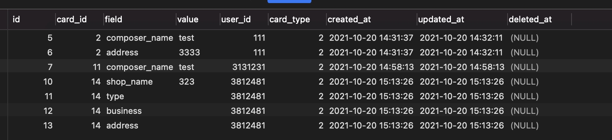
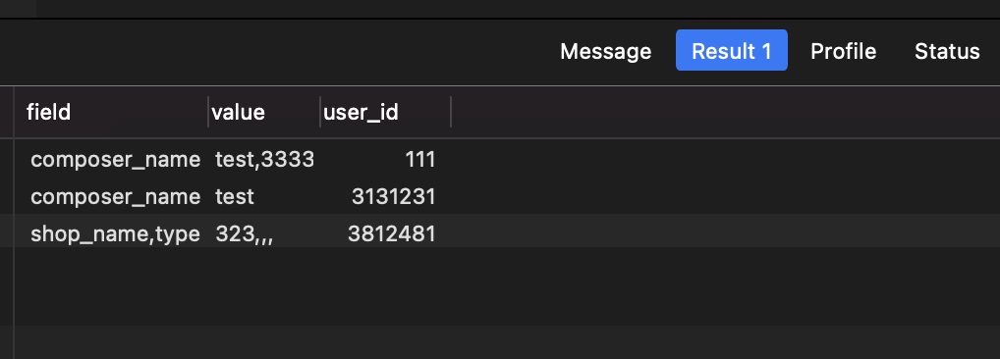

# 多条数据合并到一条数据

## 列表查询
```sql
	SELECT * FROM tb_home_card_content where card_type = 2 
```




### 组合查询
```sql
SELECT
	GROUP_CONCAT( `field` ) AS `field`,
	GROUP_CONCAT( `VALUE` ) AS `value`,
	user_id 
FROM
	tb_home_card_content 
WHERE
	card_type = 2 

GROUP BY
	user_id
```



	
	