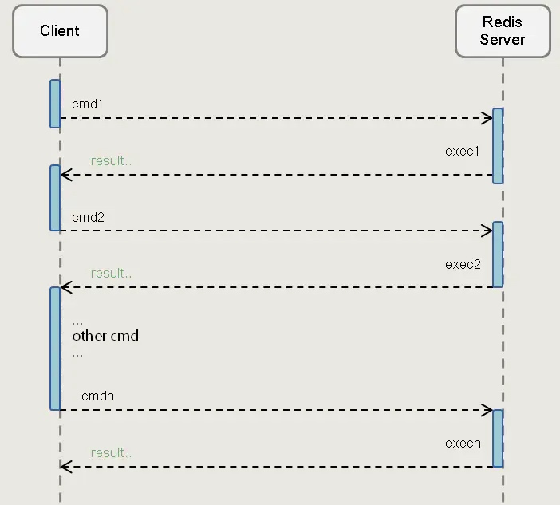
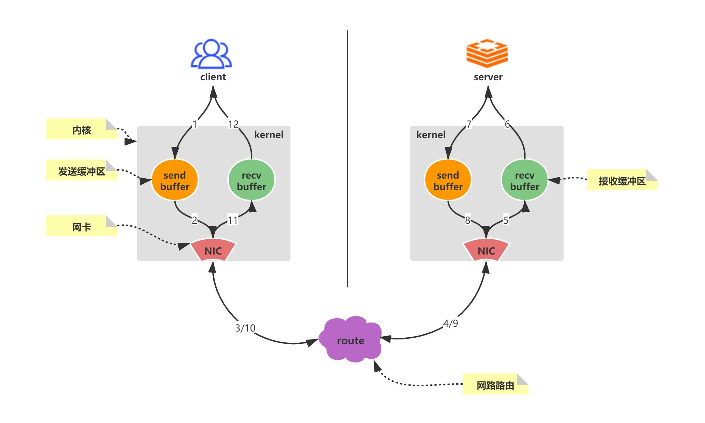
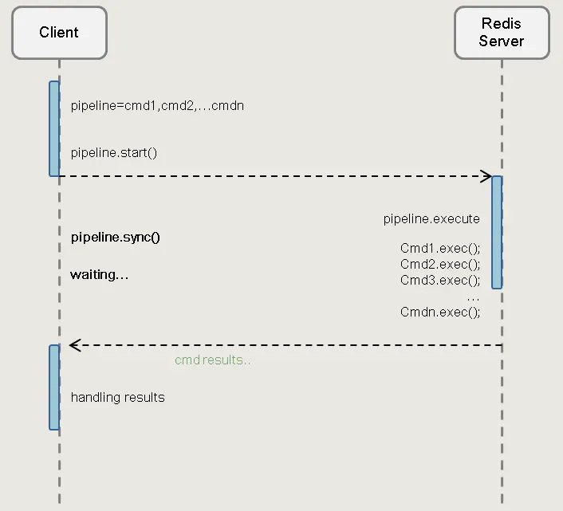

# Pipeline 管理

### pipeline 出现的背景

一次 Redis 客户端发起的请求，经过服务端的响应后， 大致会经历如下的步骤：

1. 客户端发起一个 (查询/插入) 请求， 并监听 socket 返回， 通常情况都是阻塞模式等待 Redis 服务器的响应
2. 服务端处理命令， 并且返回处理结束给客户端
3. 服务端接收到服务的返回结果，程序从阻塞代码处返回

普通请求模式：

Redis 是一个基于 TCP 协议的 CS 架构的内存数据库，所有的操作都是一个Request 与 一个Response的同步操作。 redis每接收到一个命令都会处理一个命令，并同步返回结果。这样就来的问题就是，一个命令就会产生一次 RTT （Round Time Trip),这样的话必然会消耗大量网络IO。

### pipeline 解决 RTT 问题

为了提高redis的读写能力，所以pipeline 的出现，对于多个命令执行，不再同步等待每个命令返回结果， 会在统一一个时间点获取Response。 这样就解决多个 RTT的问题 

Redis 客户端-服务端的一次完整的网络请求来回

1. 客户端调用 write 将数据写入操作系统内核(kernel) 为socket 连接分配的发送缓存区(send buffer)
2. 客户端操作系统内核将发送缓冲区(send buffer)的数据发送到网卡（NIC）
3. 网卡（NIC）将数据通过路由（route）将数据送到 Redis 服务器机器网卡（NIC）
4. 服务器操作系统内核(kernel)将网卡(NIC)接收的数据，写入内核为 socket 分配的接收缓冲区（recv buffer）
5. 服务器进程从接收缓冲区调用 read 读取数据， 并进行数据逻辑处理
6. 数据处理完成之后， 服务器进程调用 write 将响应数据写入操作系统内核为 socket 分配的发送缓冲区
7. 操作系统内核将发送缓冲区的数据发送到服务器网卡
8. 服务器网卡将响应数据通过路由发送到客户端网卡
9. 客户端网卡接收响应数据
10. 服务端操作系统内核读取网卡接收到的服务器响应数据，并写入操作系统为 socket 连接分配的介绍缓冲区
11. 客户端进程调用 read 从接收缓冲区中读取服务器响应数据
12. 一次完整网络请求来回过程结束

对于 pipeline 技术，就是将 n *·12 个步骤，合成 1 *12 ，这样服务请求相应总体时间将会大大减少

**注意**： 在上述网络请求来回中，可能出现 io 堵塞
1. 当 write 操作发生， 并且发送缓去冲区（send buffer） 满时，就会导致 write 操作阻塞
2. 当 read 操作发生，并且接收缓冲（recv buffer） 满时 ，就会导致 read 操作堵塞

Pipeline 请求模式

