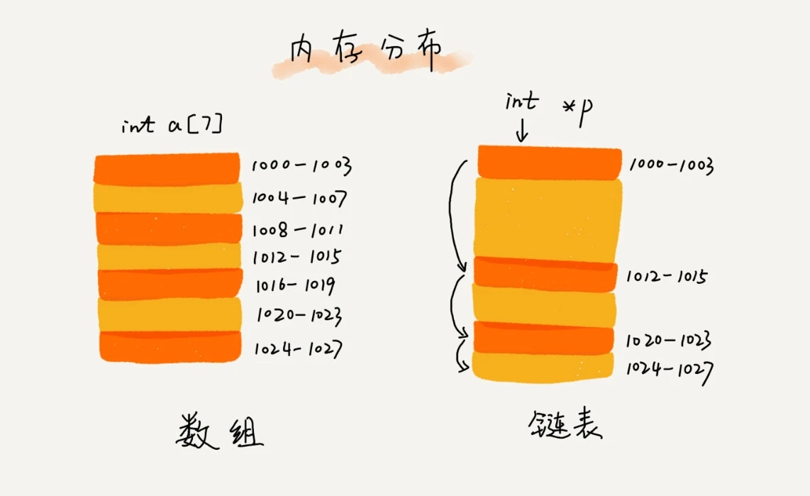

# 链表与数组

### 差别
不准确的说法：


链表适合插入、删除，时间复杂度O(1);数组适合查找,查找时间复杂度为 O(1) 

正确说法：

数组是适合查找操作，但是查找的时间复杂度并不为O(1). 即便是排好序的数组，用二分查找，时间复杂度也是O(logn) 正确的是：数组支持随机访问，根据下标随机访问的时间复杂度为O(1)


### 数组越界

栈地址： arr[0],arr[1],arr[2],i arr[3]越界，和i指向了同一块内存，arr[3]=0使得i也重新变成了0 因此此段代码会是无限循环

代码：arr1.c

```c
int main(int argc, char* argv[]){
  int i = 0; 
  int arr[3] = {0}; 
  for(; i<=3; i++){
     arr[i] = 0; printf("hello world\n"); 
  } 
  return 0;
}
```

运行代码：
```bash
gcc -xc arr2.c
./a.out
输出结果:
hello world
hello world
hello world
hello world
```

结果和编译器的实现有关，gcc有一个编译选项（-fno-stack-protector）用于关闭堆栈保护功能。默认情况下启动了堆栈保护，不管i声明在前还是在后，i都会在数组之后压栈，只会循环4次；如果关闭堆栈保护功能，则会出现死循环。

需要关闭堆栈保护功能

```bash
gcc -xc arr2.c -fno-stack-protector
./a.out
输出结果:
hello world
hello world
hello world
hello world
hello world
hello world
hello world
....
```

函数体内的局部变量存在栈上，且是连续压栈。在Linux进程的内存布局中，栈区在高地址空间，从高向低增长。变量i和arr在相邻地址，且i比arr的地址大，所以arr越界正好访问到i。当然，前提是i和arr元素同类型，否则那段代码仍是未决行为。


### 底层的存储结构

从图中看到，数组需要一块连续的内存空间来存储，对内存的要求比较高。如果我们申请一个 100MB 大小的数组，当内存中没有连续的、足够大的存储空间时，即便内存的剩余总可用空间大于 100MB，仍然会申请失败

而链表恰恰相反，它并不需要一块连续的内存空间，它通过“指针”将一组零散的内存块串联起来使用，所以如果我们申请的是 100MB 大小的链表，根本不会有问题


链表结构五花八门，今天我重点给你介绍三种最常见的链表结构，它们分别是：单链表、双向链表和循环链表。我们首先来看最简单、最常用的单链表。

链表通过指针将一组零散的内存块串联在一起。其中，我们把内存块称为链表的“结点”。为了将所有的结点串起来，每个链表的结点除了存储数据之外，还需要记录链上的下一个结点的地址。如图所示，我们把这个记录下个结点地址的指针叫作后继指针 next。


C语言链表(超详细) 参考链接：
https://zhuanlan.zhihu.com/p/85504177